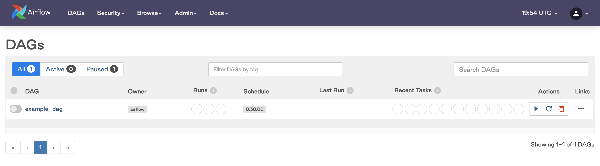
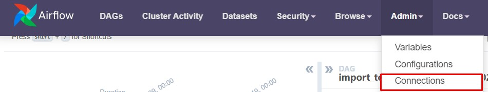
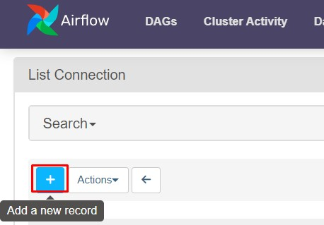
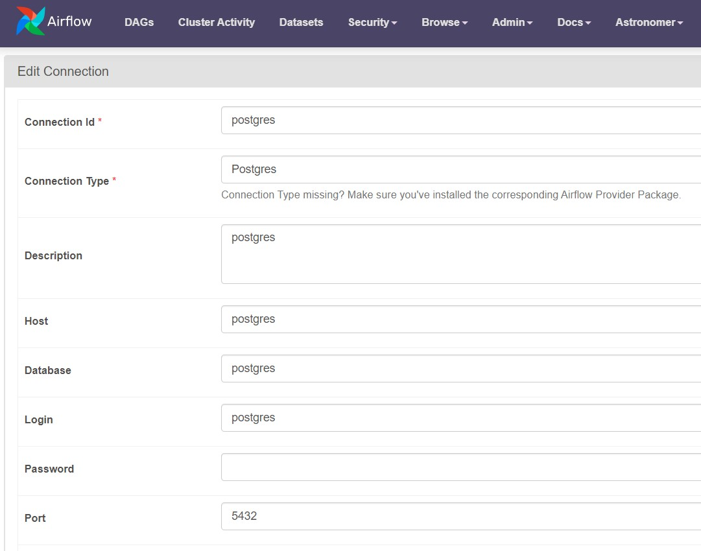
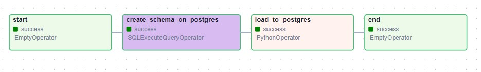
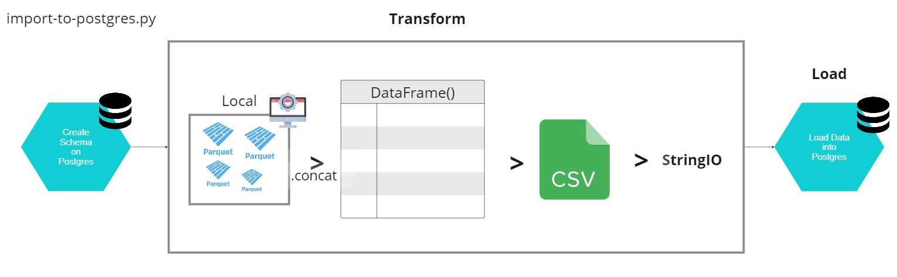
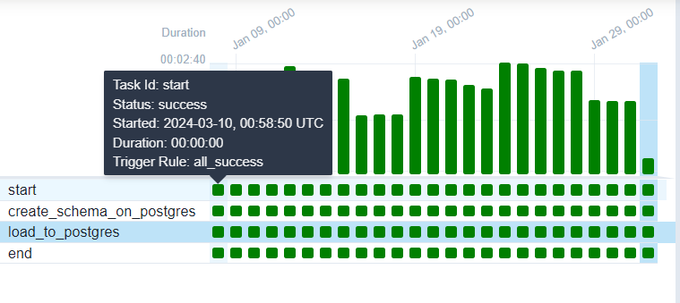
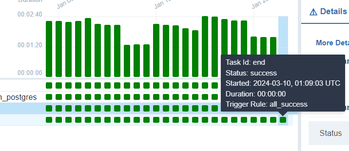
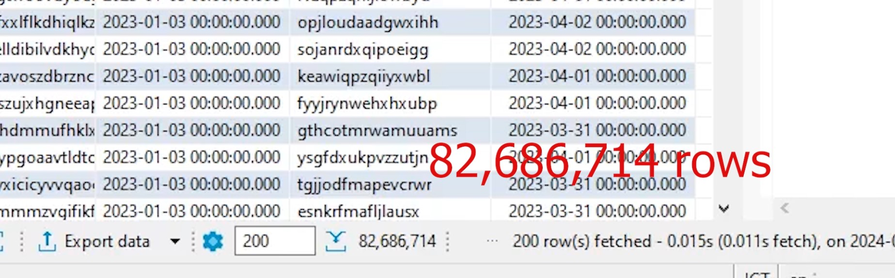

Overview
========

The purpose of this project is  to showcase the assignment from Data Wow

Project Contents
================

- dags: This folder contains the Python files for your Airflow DAGs. By default, this directory includes two example DAGs:
    - `import-to-postgres.py`: the main function is to create schema on PostgreSQL and load .parquet into it
- Dockerfile: initial Docker, command to run requirments.txt
- requirments.txt: list of libraries needed in data processing


Install the Astro CLI
=========

Open Windows PowerShell as an administrator and then run the following command:

    winget install -e --id Astronomer.Astro

more information on: https://docs.astronomer.io/astro/cli/install-cli?tab=windowswithwinget#install-the-astro-cli 


Deploy Your Project Locally
=================================

1. Choose the folder where you want to keep the project
2. Initialize Project
    
        astro dev init

    This command generates all of the project files you need to run Airflow locally

3. Run Airflow locally

        astro dev start

    After your project builds successfully, open the Airflow UI in your web browser at https://localhost:8080/
    

    This command will spin up 4 Docker containers on your machine, each for a different Airflow component:

    - Postgres: Airflow's Metadata Database
    - Webserver: The Airflow component responsible for rendering the Airflow UI
    - Scheduler: The Airflow component responsible for monitoring and triggering tasks
    - Triggerer: The Airflow component responsible for triggering deferred tasks

    Verify that all 4 Docker containers were created by running 
        
        'docker ps'.


4. Normally, the project automatically generated will hide the compose.yaml
    
    To config our own docker compose; first, export .yaml

        astro dev object export --compose

    The exported object will be named `compose.yaml`, you can change the name up to your need

5. After done configuring docker compose, it needs to close down and re-start the astro with {new docker compose name}.yaml


        astro dev stop
        astro dev start --compose-file docker-compose.override.yaml 

6. To delete volume

        astro dev kill


Access the Airflow UI for your local Airflow project. To do so, go to http://localhost:8080/ and log in with 'admin' for both your Username and Password.

You should also be able to access your Postgres Database at 'localhost:5432/postgres'. By default, both Username and Password are 'postgres'


==============================


Make airflow connects Postgresql
===============

1. On top bar in http://localhost:8080/

    go to Admin > Connection

    

2. Add new connection
    

3.  Connection Id: postgres

    Connection Type: Postgres

    Host: postgres

    Database: postgres

    Login: postgres

    Password: postgres

    Port: 5432
    

Data Schema
===


Dag explain
===
`import-to-postgres.py`





1. Create the schema on PostgreSQL

    ```python
    create_schema = SQLExecuteQueryOperator(
            task_id='create_schema_on_postgres',
            conn_id="postgres",
            sql=f"""
                CREATE SCHEMA IF NOT EXISTS dbo;
                CREATE TABLE IF NOT EXISTS dbo.sampledata_datawow (
                
                    department_name VARCHAR(100),
                    sensor_serial VARCHAR(100),
                    create_at TIMESTAMP,
                    product_name VARCHAR(100),
                    product_expire TIMESTAMP
                );
                
            
            """,
        )
    ```

2. Load the data from local Machine to ProgreSQL

    2.1 Create Connection

    ```python
        # Create Connection used in .copy_expert
        conn = psycopg2.connect(
            dbname='postgres',
            user='postgres',
            password='postgres',
            host='postgres',
            port='5432'
            )

    ```

    2.2 Make a function that will read .parquet into a single dataframe per day > Convert to CSV > and load it into ProgreSQL using .copy_expert

    For example, 
    1st run `2023-01-01 00_00_00.parquet`, `2023-01-01 00_01_00.parquet`, ..., `2023-01-01 23_58_00.parquet`, `2023-01-01 23_59_00.parquet` into one pandas DataFrame > Convert to CSV > load to Postgres.

    2nd run `2023-01-02 00_00_00.parquet`, `2023-01-02 00_01_00.parquet`, ..., `2023-01-02 23_58_00.parquet`, `2023-01-02 23_59_00.parquet` into one pandas DataFrame > Convert to CSV > load to Postgres.

    and so on..

    I have set on docker-compose.override.yaml

        AIRFLOW__CORE__MAX_ACTIVE_RUNS_PER_DAG: "5"

    meaning the dag will have maximam 5 runs in the same == parallelly loading 5 days of data

    ```python


    def _read_parquet(ds):

            # Check file
            ds_date = f"{ds}"
            print(ds_date) #The DAG run’s logical date as YYYY-MM-DD #2023-01-01
            

            # Set the directory containing parquet files
            data_directory = "/usr/local/airflow/include/data_sample"
            
            # Get list of files to process
            files = [file for file in os.listdir(data_directory) if file.endswith('.parquet') and ds in file]
            
            # # Read all parquet files into a single DataFrame
            dfs = [pd.read_parquet(os.path.join(data_directory, file), use_threads=True) for file in files]
            df_concat = pd.concat(dfs, ignore_index=True)


            sio = StringIO()
            writer = csv.writer(sio)
            writer.writerows(df_concat.values)
            sio.seek(0)
            with conn.cursor() as c:
                c.copy_expert(
                    sql="""
                    COPY dbo.sampledata_datawow (
                        department_name,
                        sensor_serial,
                        create_at,
                        product_name,
                        product_expire 
                    ) FROM STDIN WITH CSV""",
                    file=sio
                )
                conn.commit()

    ```

    **Note**
    {ds} is a `Jinja Templating` that airflow has provided, it will extract the DAG run’s logical date

    For example,

     ```py

            with DAG(
        dag_id='import_to_postgres_s',
        default_args=default_args,
        description='Incrementally Copy file from source',
        schedule_interval="@daily",
        start_date=datetime(2023, 1, 1), #<<< the DAG run’s logical date
        end_date=datetime(2023, 1, 31) #<<< the DAG run’s logical date
        
        )

     ```

    In 1st run, {ds} will return '2023-1-1'

    In last run, {ds} will return '2023-1-31'


    more reference on: https://airflow.apache.org/docs/apache-airflow/stable/templates-ref.html


    Result
    ===

    Using ~16 mins to load ~6GB of .parquet with 82,686,714 rows into Postgres Database
    
    

    
    
    